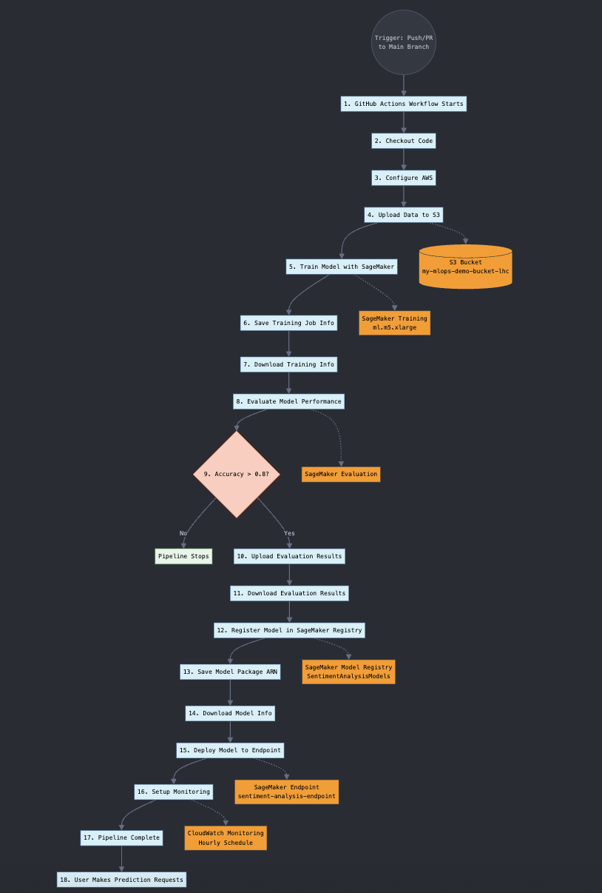

<h2><strong>Luis Angelo Hernandez Centti</strong></h2>

## Diagram

s3 bucket:

my-mlops-demo-bucket

Detailed Data Flow Explanation

Data Preparation & Storage

The sample data (train.csv and test.csv) is stored in your GitHub repository
When the GitHub Actions workflow runs, it uploads these files to an S3 bucket
S3 maintains versioning of these files, allowing you to track data changes

Training Pipeline

GitHub Actions triggers the training script (train_model.py)
The script creates a SageMaker training job using the scikit-learn container
Data is fetched from S3 by SageMaker for training
The model is trained according to your hyperparameters
The resulting model artifacts are stored back in S3

Evaluation Process

The evaluate_model.py script retrieves the trained model's metrics
It analyzes metrics like accuracy, precision, recall, and F1 score
Results are stored in a JSON file, which is passed to the next stage
A quality threshold is checked (e.g., accuracy > 0.8) to determine if the model should proceed

Model Registration

If the model passes quality checks, register_model.py registers it in the SageMaker Model Registry
The model is stored with its metadata, including performance metrics
The Model Registry maintains versions and approval status of different models

Deployment Phase

deploy_model.py creates or updates a SageMaker endpoint with the approved model
The endpoint provides a REST API for real-time inference
If an endpoint already exists, it's updated rather than creating a new one

Monitoring Setup

setup_monitoring.py configures CloudWatch monitoring for the endpoint
Data capture is enabled to collect inference data
Baselines are established for detecting data drift
Scheduled monitoring jobs check for model performance degradation

Inference Flow

External applications send prediction requests to the SageMaker endpoint
The endpoint processes these requests using the deployed model
Predictions are returned to the calling application
Inference data is captured for monitoring

Key Components and Their Roles

GitHub Actions: Orchestrates the entire workflow, passing artifacts between jobs
S3: Central storage for datasets, model artifacts, and evaluation results
SageMaker Training: Executes the machine learning training job in a managed environment
SageMaker Model Registry: Tracks model versions and approval status
SageMaker Endpoints: Hosts models for real-time inference
CloudWatch: Monitors model performance and detects data drift

Sample Data Explanation

train.csv: Contains 100 customer reviews with sentiment labels (1=positive, 0=negative)
test.csv: Contains 30 additional reviews for testing model performance

Both files have two columns:

review_text: The customer review text
sentiment: Binary sentiment label (1 for positive, 0 for negative)

This dataset is perfect for our sentiment analysis example because:

It's simple enough to understand quickly
It demonstrates text classification, a common ML task
The balanced classes (positive/negative) help with model evaluation
It's realistic enough to show meaningful results

--------------------------------
Description of scripts:

1- train_model.py - Model Training Orchestration
What it does:

Launches a Managed Training Job in SageMaker:

Provisions temporary compute (ml.m5.xlarge by default).

Automatically terminates resources after training completes (pay-per-use).

Configures the Training Environment:

Uses SageMaker's pre-built Scikit-Learn container (0.23-1 version).

Runs your custom training code (train.py – the actual ML logic).

Passes hyperparameters (e.g., max_depth=5) as JSON.

Handles Data Flow:

Input: Reads training/test data from S3 (s3://bucket/prefix/data/train.csv).

Output: Saves model artifacts to S3 (s3://bucket/prefix/output/).

Tracks the Training Job:

Saves the job name (training_job_name.txt) for downstream steps (evaluation/deployment).

2- evaluate_model.py - Model Validation
What it does:

Downloads evaluation metrics (accuracy, precision, recall) from S3 after training.

Falls back to dummy metrics if evaluation fails (demo safety net).

Prints metrics for GitHub Actions to use in approval gates.

Key AWS Services:

SageMaker Training Jobs (to fetch output location)

S3 (stores evaluation JSON)

Production Considerations:

Replace with SageMaker Model Monitor for drift detection.

Add business metrics (e.g., ROI impact).

Enforce minimum thresholds (fail pipeline if accuracy < X%).

3. register_model.py - Model Governance
What it does:

Registers a trained model in the SageMaker Model Registry.

Creates a model package group if it doesn't exist.

Attaches evaluation metrics from S3.

Sets status to "Approved" (auto-approval for demo).

Key AWS Services:

SageMaker Model Registry

S3 (stores evaluation metrics)

Production Considerations:

Manual approval workflow (change ModelApprovalStatus='PendingManualApproval').

Add metadata tags (e.g., training data version).

Store bias/fairness metrics for compliance.

4- deploy_model.py - Model Deployment
What it does:

Deploys a registered model from SageMaker Model Registry to a real-time endpoint.

Checks if an endpoint exists:

If yes → Updates the endpoint with the new model (zero-downtime deployment).

If no → Creates a new endpoint.

Uses ModelPackage to pull the approved model artifact from the registry.

Key AWS Services:

SageMaker Model Registry

SageMaker Endpoints (real-time inference)

CloudWatch (implicitly for endpoint metrics)

Production Considerations:

Add auto-scaling (scaling_policy in boto3).

Use blue/green deployments for critical models.

Deploy to multiple regions if global.

5. setup_monitoring.py - Production Monitoring
What it does:

Enables data capture for all endpoint requests/responses.

Creates a baseline from training data.

Sets up a cron-based monitoring schedule (e.g., hourly checks).

Uses Model Monitor to detect data drift.

Key AWS Services:

SageMaker Model Monitor

S3 (stores captured data)

CloudWatch (alerts on anomalies)

Production Considerations:

Monitor feature drift (not just data schema).

Add custom monitoring scripts for business rules.

Set up SNS alerts for critical failures.

Check AWS Console to see the created resources:

SageMaker training jobs
SageMaker models and endpoints
CloudWatch monitoring configurations
